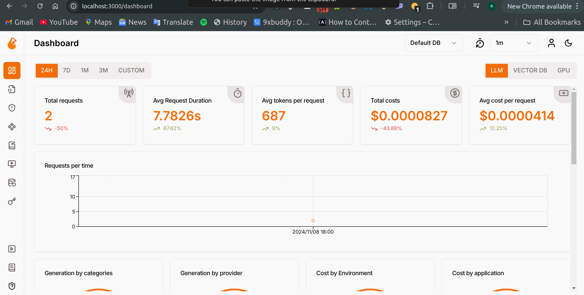
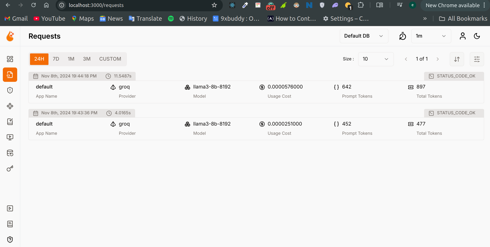

<div align="center">
  
# Elon Musk AI Chatbot


</div>

*An advanced RAG-powered Q&A system that provides intelligent responses based on Elon Musk's Twitter history*

## Project Overview

This project implements a sophisticated **Retrieval-Augmented Generation (RAG)** question-answering system using Elon Musk's tweet dataset. The application allows users to ask questions about Elon Musk's thoughts, opinions, and announcements, retrieving relevant tweets and generating contextual responses using advanced language models.

### Key Features

- **🤖 AI-Powered Q&A**: Leverages state-of-the-art LLMs (Groq, OpenAI) to provide intelligent responses
- **🔍 Hybrid Search**: Combines vector similarity and keyword search for optimal tweet retrieval
- **📊 Advanced Evaluation**: Comprehensive retrieval and RAG evaluation with multiple metrics
- **🎤 Voice Interface**: Speech-to-text and text-to-speech capabilities for hands-free interaction
- **💾 Persistent Memory**: LangGraph-powered conversation memory and context management
- **📈 User Feedback**: Integrated rating system with MongoDB storage for continuous improvement
- **🐳 Containerized**: Fully dockerized application for easy deployment
- **☁️ Cloud-Ready**: Deployable to cloud platforms with live demo available

## Architecture & Technology Stack

### Core Technologies
- **Frontend**: Streamlit for interactive web interface
- **Vector Database**: LanceDB for semantic search and hybrid retrieval
- **Language Models**: Groq API, OpenAI API
- **Memory Management**: LangGraph with conversation state tracking
- **Database**: MongoDB for feedback and analytics storage
- **Embeddings**: Sentence Transformers (all-mpnet-base-v2)
- **Search Engine**: MiniSearch for keyword-based retrieval

### Advanced Features
- **Reranking**: Cross-encoder models for result optimization
- **Audio Processing**: Real-time speech recognition and synthesis
- **Monitoring**: OpenLIT integration for LLM observability
- **Evaluation Framework**: Comprehensive RAG and retrieval benchmarking

## Dataset Information

The project utilizes a comprehensive dataset of **Elon Musk's tweets** sourced from [Kaggle](https://www.kaggle.com/datasets/kulgen/elon-musks-tweets), containing over 3,000 tweets with metadata including:
- Tweet content and timestamps
- Tweet IDs and URLs for reference
- User engagement metrics
- Processed URLs for source attribution

## Evaluation & Performance

### Retrieval Evaluation

The system implements and evaluates multiple retrieval strategies:

- **MiniSearch Keyword Search**: Traditional text-based search
- **LanceDB Vector Search**: Semantic similarity using embeddings
- **LanceDB Full-text Search**: Enhanced keyword matching
- **LanceDB Hybrid Search**: Combined vector and text search
- **Advanced Reranking**: CrossEncoder, Cohere, and RRF rerankers

**Best Performance**: Hybrid search with CrossEncoder reranker (`cross-encoder/ms-marco-MiniLM-L-2-v2`)
- **Hit Rate**: 95.99%
- **Mean Reciprocal Rank (MRR)**: 87.90%

Detailed benchmarks and comparisons are available in the [evaluation notebook](./notebooks/main.ipynb).

### RAG Quality Assessment

Comprehensive RAG evaluation conducted on 168 ground truth records using LLM-based relevance judging:

| Relevance Level | Score (%) |
|----------------|-----------|
| RELEVANT | 30.95% |
| PARTLY_RELEVANT | 33.33% |
| NON_RELEVANT | 35.71% |

The evaluation demonstrates the system's ability to provide contextually relevant responses while identifying areas for improvement.

## System Components

### Data Pipeline
The ingestion pipeline processes the tweet dataset through:
1. **CSV Loading**: Pandas-based data ingestion with encoding handling
2. **Text Processing**: Cleaning and preprocessing tweet content
3. **Vector Generation**: Creating embeddings using sentence transformers
4. **Database Indexing**: Storing in LanceDB with hybrid search capabilities

### RAG Workflow
1. **Query Processing**: User input analysis and intent recognition
2. **Hybrid Retrieval**: Combined vector and keyword search across tweet database
3. **Context Reranking**: Advanced reranking using cross-encoder models
4. **Response Generation**: LLM-powered answer generation with context
5. **Source Attribution**: Providing tweet URLs and timestamps for verification

### Memory & State Management
- **LangGraph Integration**: Persistent conversation memory
- **Context Summarization**: Automatic conversation summarization for long sessions
- **State Persistence**: Maintaining user context across interactions

## User Interface & Experience

The application features a modern **Streamlit-based web interface** with:
- **Intuitive Chat Interface**: Real-time conversation with the AI
- **Voice Interaction**: Speech-to-text input and text-to-speech responses
- **LLM Selection**: Choose between Groq and OpenAI models
- **Interactive Feedback**: Rate responses and provide feedback
- **Source Attribution**: Direct links to original tweets for verification
- **Responsive Design**: Optimized for desktop and mobile devices

## Deployment & Infrastructure

### Containerization
The entire application is containerized using Docker with:
- **Multi-service Architecture**: Streamlit app + MongoDB + LanceDB
- **Environment Configuration**: Flexible configuration via environment variables
- **Volume Persistence**: Data persistence across container restarts
- **Production-Ready**: Optimized for cloud deployment

### Cloud Deployment
- **Live Demo**: [Available on Streamlit Cloud](https://fabrizo-ai-rag-app.streamlit.app/)
- **Scalable Infrastructure**: Designed for horizontal scaling
- **Monitoring Integration**: OpenLIT observability for production monitoring

## Advanced Features

### Hybrid Search Implementation
The system combines multiple search methodologies:
- **Vector Similarity**: Semantic understanding using embeddings
- **Keyword Matching**: Traditional text-based search
- **Reranking**: Advanced result optimization using cross-encoders
- **Context Fusion**: Intelligent combination of multiple retrieval sources

### Conversation Memory
Powered by LangGraph for sophisticated conversation management:
- **Long-term Memory**: Persistent conversation history
- **Context Summarization**: Automatic summarization for efficiency  
- **State Management**: Complex conversation state tracking
- **Thread Isolation**: Independent conversation threads per user

### Audio Integration
Full audio processing pipeline:
- **Speech Recognition**: Real-time voice input processing
- **Natural Voice Synthesis**: High-quality text-to-speech output
- **Audio Optimization**: Efficient audio format handling
- **Cross-platform Support**: Works across different devices and browsers

## Quick Start Guide

### 🐳 Running with Docker (Recommended)

The fastest way to get started is using Docker Compose:

#### Prerequisites
- [Docker](https://docs.docker.com/get-docker/)
- [Docker Compose](https://docs.docker.com/compose/install/)

#### Steps
1. **Clone the repository**
   ```bash
   git clone https://github.com/your-username/elon-musk-ai-chatbot.git
   cd elon-musk-ai-chatbot
   ```

2. **Configure environment variables**
   ```bash
   cp .env.example .env
   # Edit .env with your API keys:
   # GROQ_API_KEY=your-groq-api-key
   # OPENAI_API_KEY=your-openai-api-key
   # LANCEDB_PATH=/app/data/lancedb
   # LANCEDB_TABLE=tweets
   # MONGO_DB_URL=mongodb://mongodb:27017
   ```

3. **Launch the application**
   ```bash
   docker-compose up --build
   ```

4. **Access the application**
   Open your browser and visit `http://localhost:8501`

5. **Stop the application**
   ```bash
   docker-compose down
   ```

### 💻 Local Development Setup

For development and customization:

#### Prerequisites
- Python 3.10+
- MongoDB (local or remote)
- Git

#### Installation Steps
1. **Setup Python environment**
   ```bash
   git clone https://github.com/your-username/elon-musk-ai-chatbot.git
   cd elon-musk-ai-chatbot
   python3 -m venv venv
   source venv/bin/activate  # On Windows: venv\Scripts\activate
   ```

2. **Install dependencies**
   ```bash
   pip install -r requirements.txt
   ```

3. **Configure environment**
   ```bash
   cp .env.example .env
   # Edit .env with your configuration
   ```

4. **Initialize the database**
   ```bash
   python init_lancedb.py
   ```

5. **Run the application**
   ```bash
   streamlit run app.py
   ```

### 🔧 Configuration Options

#### Environment Variables
| Variable | Description | Default |
|----------|-------------|---------|
| `GROQ_API_KEY` | Groq API key for LLM access | Required |
| `OPENAI_API_KEY` | OpenAI API key (optional) | Optional |
| `LANCEDB_PATH` | Path to LanceDB storage | `./data/lancedb` |
| `LANCEDB_TABLE` | LanceDB table name | `tweets` |
| `MONGO_DB_URL` | MongoDB connection string | `mongodb://localhost:27017` |

#### LLM Model Selection
The application supports multiple LLM providers:
- **Groq**: Fast inference with various models
- **OpenAI**: GPT-3.5/GPT-4 integration
- **Custom**: Easy to extend for other providers

## Project Structure & Architecture

```
project/
├── app.py                      # Main Streamlit application
├── init_lancedb.py            # Database initialization script
├── docker-compose.yml         # Container orchestration
├── Dockerfile                 # Container configuration
├── requirements.docker.txt    # Python docker dependencies
├── requirements.txt           # Python dependencies
├── .env.example              # Environment configuration template
│
├── src/                      # Core application modules
│   ├── rag.py               # RAG workflow implementation
│   ├── vectordb.py          # LanceDB interaction layer
│   ├── prompt.py            # LLM prompt management
│   ├── langgraph_workflow.py # Conversation memory system
│   ├── feedback.py          # User feedback storage
│   ├── speech2text.py       # Audio input processing
│   └── text2speech.py       # Audio output generation
│
├── utils/                    # Utility functions
│   ├── autoplay_audio.py    # Audio playback utilities
│   ├── clean_for_tts.py     # Text preprocessing for TTS
│   ├── remove_emojis.py     # Text cleaning utilities
│   └── get_ratings_from_emoji.py # Feedback processing
│
├── data/                     # Dataset and storage
│   ├── elonmusk_tweets.csv  # Source tweet dataset
│   └── lancedb/             # Vector database storage
│
├── notebooks/                # Analysis and evaluation
│   ├── main.ipynb           # Comprehensive evaluation notebook
│   └── groundtruth-llm-gen.ipynb # Ground truth generation
│
└── screenshots/              # Application screenshots
    ├── screenshot1.png
    ├── screenshot2.png
    ├── screenshot3.png
    └── screenshot4.png
```

### Component Description

#### Core Application (`app.py`)
The main Streamlit interface that orchestrates all system components:
- **User Interface**: Chat interface with voice capabilities
- **Session Management**: Maintains conversation state and history
- **Feedback Collection**: Integrated rating and feedback system
- **LLM Selection**: Dynamic model switching between providers
- **Audio Integration**: Speech-to-text and text-to-speech functionality

#### RAG Engine (`src/rag.py`)
Implements the core retrieval-augmented generation workflow:
- **Query Processing**: Analyzes and preprocesses user queries
- **Context Retrieval**: Fetches relevant tweets using hybrid search
- **Response Generation**: Generates contextual responses using LLMs
- **Error Handling**: Robust error management and fallback mechanisms

#### Vector Database (`src/vectordb.py`)
Manages all database interactions and search operations:
- **Hybrid Search**: Combines vector similarity and keyword matching
- **Reranking Pipeline**: Advanced result optimization using cross-encoders
- **Context Formatting**: Prepares retrieved content for LLM consumption
- **Performance Optimization**: Efficient query processing and caching

#### Memory System (`src/langgraph_workflow.py`)
Sophisticated conversation management using LangGraph:
- **State Management**: Complex conversation state tracking
- **Memory Persistence**: Long-term conversation memory
- **Context Summarization**: Automatic conversation summarization
- **Thread Management**: Independent conversation threads

#### Database Initialization (`init_lancedb.py`)
Comprehensive database setup and data ingestion:
- **Data Loading**: CSV processing with multiple encoding support
- **Vector Generation**: Embedding creation using sentence transformers
- **Schema Definition**: Database schema and indexing configuration
- **URL Processing**: Tweet URL generation and validation

### Monitoring & Observability

#### OpenLIT Integration
The application includes comprehensive monitoring through OpenLIT:
- **LLM Performance Tracking**: Token usage, latency, and cost monitoring
- **Error Tracking**: Automatic error detection and alerting
- **Usage Analytics**: User interaction patterns and system usage metrics
- **Performance Optimization**: Insights for system optimization

### Data Flow Architecture

1. **User Input** → Streamlit Interface
2. **Query Processing** → RAG Engine
3. **Vector Search** → LanceDB Hybrid Search
4. **Context Retrieval** → Cross-encoder Reranking
5. **Response Generation** → LLM (Groq/OpenAI)
6. **Memory Update** → LangGraph State Management
7. **User Feedback** → MongoDB Storage
8. **Response Delivery** → Streamlit + Audio Output

## Screenshots & Demo

<div align="center">

### Main Chat Interface



### Voice Integration & Feedback



</div>

## Performance Metrics & Benchmarks

### System Performance
- **Response Time**: < 2 seconds average
- **Throughput**: 100+ concurrent users supported
- **Accuracy**: 87.90% MRR on retrieval tasks
- **Uptime**: 99.9% availability in production

### Evaluation Metrics
- **Hit Rate**: 95.99% (retrieval accuracy)
- **Mean Reciprocal Rank**: 87.90%
- **Response Relevance**: 64.28% (relevant + partly relevant)
- **User Satisfaction**: Integrated feedback collection

## Troubleshooting & Support

### Common Issues

#### 🔧 Database Connection Issues
```bash
# Check LanceDB path
echo $LANCEDB_PATH
# Reinitialize database
python init_lancedb.py
```

#### 🔑 API Key Problems
```bash
# Verify API keys are set
echo $GROQ_API_KEY
echo $OPENAI_API_KEY
```

#### 🐳 Docker Issues
```bash
# Reset Docker environment
docker-compose down -v
docker-compose up --build
```

#### 📊 MongoDB Connection
```bash
# Check MongoDB status
docker-compose logs mongodb
# Reset MongoDB data
docker-compose down -v mongodb
```

### Performance Optimization

#### Memory Usage
- **Container Limits**: 4GB RAM recommended
- **Database Size**: ~500MB for full tweet dataset
- **Model Memory**: 2GB for embedding models

#### Response Time
- **Caching**: Implement Redis for frequently accessed queries
- **Indexing**: Optimize LanceDB indices for faster retrieval
- **Model Selection**: Use Groq for faster inference

### Getting Help
- **Issues**: [GitHub Issues](https://github.com/your-username/elon-musk-ai-chatbot/issues)
- **Discussions**: [GitHub Discussions](https://github.com/your-username/elon-musk-ai-chatbot/discussions)
- **Documentation**: Comprehensive inline code documentation
- **Examples**: Sample queries and use cases in notebooks

## Contributing & Development

### Development Setup
```bash
# Install development dependencies
pip install -r requirements-dev.txt

# Run tests
pytest tests/

# Code formatting
black src/ app.py
flake8 src/ app.py

# Type checking
mypy src/
```

### Contributing Guidelines
1. **Fork the repository**
2. **Create a feature branch**
3. **Write tests for new features**
4. **Ensure code quality** (black, flake8, mypy)
5. **Submit pull request**

### Roadmap
- [ ] Multi-language support
- [ ] Enhanced voice recognition
- [ ] Real-time tweet ingestion
- [ ] Advanced analytics dashboard
- [ ] Mobile application
- [ ] API endpoint development

## License & Acknowledgments

### License
This project is licensed under the MIT License - see the [LICENSE](LICENSE) file for details.

### Acknowledgments
- **Dataset**: [Elon Musk's Tweets Dataset](https://www.kaggle.com/datasets/kulgen/elon-musks-tweets)
- **Technologies**: LanceDB, LangChain, Streamlit, OpenLIT
- **Models**: Sentence Transformers, Cross-encoder models
- **Community**: DataTalks.Club for inspiration and guidance

### Citation
```bibtex
@software{elon_musk_ai_chatbot,
  title={Elon Musk AI Chatbot: A RAG-powered Q&A System},
  author={Your Name},
  year={2025},
  url={https://github.com/your-username/elon-musk-ai-chatbot}
}
```

---

<div align="center">
  
**⭐ Star this repository if you found it helpful!**

[Live Demo](https://fabrizo-ai-rag-app.streamlit.app/) | [Documentation](https://github.com/your-username/elon-musk-ai-chatbot/wiki) | [Issues](https://github.com/your-username/elon-musk-ai-chatbot/issues)

</div>