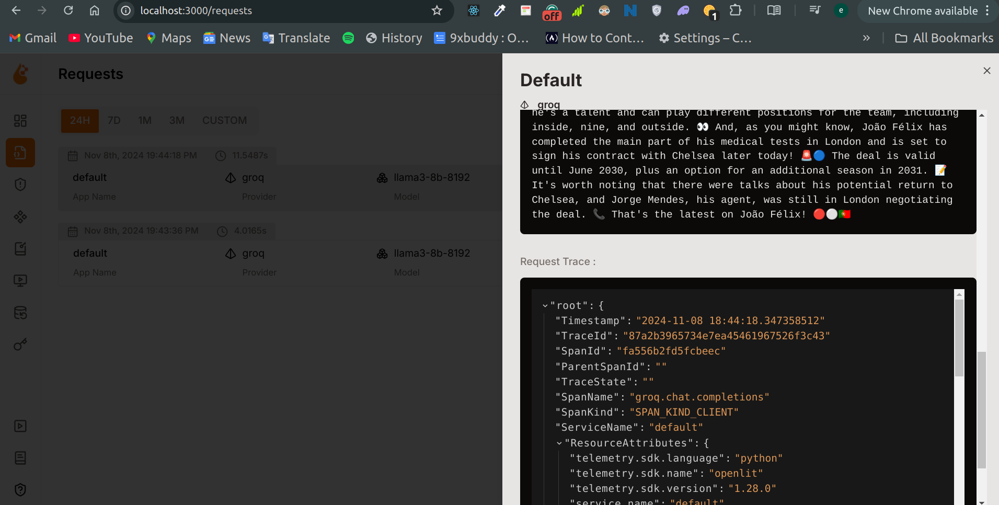

<div align="center">
  
# Elon Musk AI Chatbot


</div>

#### Evaluation of Q&A System using Elon Musk Tweets

Evaluations can be found in [The Jupyter Notebook](./notebooks/main.ipynb)

## Problem Description

The project is a question-answering (Q&A) system using Elon Muk tweets (https://www.kaggle.com/datasets/kulgen/elon-musks-tweets), allowing users to ask football-related questions and retrieve relevant tweets to provide answers using a language model (LLM). The project solves the problem of retrieving football information from a specific dataset of scraped tweets. **The tweets were scraped by me from twitter**

### RAG Flow

- **Knowledge Base**: Used `minsearch` for indexing and searching the supplier data. Also used `lancedb` as a vector store
- **LLM**: Used Groq API & MistralAI API to generate answers based on the retrieved results.

## Retrieval Evaluation

Multiple retrieval approaches are evaluated, including:
- MiniSearch keyword search
- LanceDB vector search (semantic search)
- LanceDB full-text search
- LanceDB hybrid search (combining vector and text search)
- Re-ranking with CrossEncoder, Cohere, and RRF rerankers.

Hybrid evaluation with Crossencoder reranker is using `"cross-encoder/ms-marco-MiniLM-L-2-v2"` model had the best results with `{'hit_rate': 0.959866220735786, 'mrr': 0.8790040876997403}`

The benchmarks of each approach can be found in [The Jupyter Notebook](./notebooks/main.ipynb)


The project application uses these evaluations to find the best-performing retrieval method.

## RAG Evaluation

**Score: 2/2**  
Multiple RAG approaches are evaluated. A prompt is used to query the Mistral LLM.
An additional RAG evaluation over 168 records of ground truth data is done using an LLM to judge the relevance of the generated responses. 
The results of the Evaluation of 168 records:
**Relevance**  -     **Score**
NON_RELEVANT    -   35.714286
PARTLY_RELEVANT  -  33.333333
RELEVANT          - 30.952381

## Interface

The Project is built using Streamlit as the Interface

## Ingestion Pipeline

A python script is used to read the csv file of scraped tweets from the [/data folder](./data/elonmusk_tweets.csv). The dataset is loaded into a pandas DataFrame in the notebook, and documents are then ingested into LanceDB and also Minisearch in the notebook.


## Containerization
The entire app is Containerized in docker

## Best Practices

**Hybrid Search**:  
Hybrid search is implemented using LanceDB's combination of text and vector search. It's also evaluated with rerankers.

**Document Re-ranking**:    
Document re-ranking is implemented using various rerankers, including CrossEncoder, Cohere, and RRF rerankers.

**Deployment to the cloud**:  
- [Live Demo on Streamlit](https://fabrizo-ai-rag-app.streamlit.app/)

### Reproducibility

#### Running the Application with Docker

To run the entire app (Streamlit + MongoDB + LanceDB setup) using Docker, follow these steps:

### Prerequisites

Ensure you have Docker and Docker Compose installed:
- [Docker](https://docs.docker.com/get-docker/)
- [Docker Compose](https://docs.docker.com/compose/install/)

### Steps

1. Clone this repository and navigate to the project directory.

   ```bash
   git clone https://github.com/ebukachuqz/fabrizo-ai-rag-app.git
   cd fabrizo-ai-rag-app
   ```

2. Create a `.env` file in the project root and provide the required environment variables:

   ```bash
   touch .env
   ```

   Add the following to the `.env` file:

   ```bash
   GROQ_API_KEY=your-groq-api-key
   LANCEDB_PATH=/app/data/lancedb
   LANCEDB_TABLE=tweets
   MONGO_DB_URL=mongodb://mongodb:27017
   ```

3. Build and run the Docker containers:

   ```bash
   docker-compose up --build
   ```

4. Open your browser and visit `http://localhost:8501` to interact with the application.

   You can start asking questions, and the application will provide answers using Retrieval-Augmented Generation with data from Elon Musk's Twitter page. Additionally, you can rate the responses and provide feedback that is stored in MongoDB.

5. To stop the application, press `CTRL+C` in your terminal, and then run:

   ```bash
   docker-compose down
   ```

---

## Running the Application Without Docker

If you want to run the app directly without Docker, follow these steps:

### Prerequisites

- Python 3.10+
- MongoDB installed locally or access to a remote MongoDB instance
- A valid API key for Groq LLM
- Install `lancedb` (follow the instructions from the [LanceDB documentation](https://lancedb.github.io/lancedb/basic/))

### Steps

1. Clone this repository and navigate to the project directory:

   ```bash
   git clone https://github.com/ebukachuqz/fabrizo-ai-rag-app.git
   cd fabrizo-ai-rag-app
   ```

2. Create a virtual environment and activate it:

   ```bash
   python3 -m venv venv
   source venv/bin/activate
   ```

3. Install the required dependencies:

   ```bash
   pip install -r requirements.txt
   ```

4. Create a `.env` file in the project root and provide the required environment variables:

   ```bash
   touch .env
   ```

   Add the following to the `.env` file:

   ```bash
   GROQ_API_KEY=your-groq-api-key
   LANCEDB_PATH=/path/to/lancedb
   LANCEDB_TABLE=tweets
   MONGO_DB_URL=mongodb://localhost:27017  # or your remote MongoDB URL
   ```

5. Start the Streamlit app:

   ```bash
   streamlit run app.py
   ```

6. Open your browser and go to `http://localhost:8501` to interact with the application.

### Storing Feedback

To store feedback, make sure MongoDB is running locally or you are connected to a remote MongoDB instance.

### Monitoring and Observability

[OpenLIT](https://docs.openlit.io/) was used to seamlessly monitor and observe the LLMs operations of the app. It integrates with OpenTelemetry to provide monitoring for LangChain and other LLM frameworks. Refer to [OpenLIT's docs](https://docs.openlit.io/latest/integrations/langchain) for setup

### Screenshots

<p align="center">
  
  
</p>


<p align="center">
  
  
</p>

### Troubleshooting

If you encounter any issues, make sure all dependencies are installed correctly and environment variables are properly configured.


### Code Overview of the Files

1. **`init_lancedb.py`**: This file initializes LanceDB by connecting to the database, creating a table, and ingesting the Twitter data into the database. It loads the `.csv` file of scraped tweets and indexes the data with vector embeddings for efficient retrieval.

2. **`app.py`**: This is the Streamlit application that provides the user interface. It allows users to input a query (question), fetches the answer using the Retrieval-Augmented Generation (RAG) flow, and displays the relevant tweets as references. It also allows users to rate the responses and stores the feedback in MongoDB.

3. **`src/rag.py`**: Implements the core logic of the RAG flow. It queries the LanceDB database for relevant tweet contexts using hybrid search, constructs the LLM prompt using those contexts, and sends the query to the Groq LLM. It returns both the generated response and the URLs of the relevant tweets.

4. **`src/vectordb.py`**: Contains the logic for interacting with LanceDB. It handles hybrid search using both vector embeddings and keyword search. It also performs reranking of results using a cross-encoder model to improve the quality of the retrieved context.

5. **`src/prompt.py`**: This file constructs the prompt that will be sent to the Groq LLM. It formats the prompt by embedding the retrieved context (tweets) and the user's query. It also handles the interaction with the Groq LLM by sending the prompt and receiving the response.

6. **`src/feedback.py`**: Implements the logic for storing user feedback. It connects to MongoDB and inserts feedback data, such as the user's query, the LLM's response, and the user's rating.

7. **`Dockerfile`**: Defines the Docker image for the application. It sets up the Python environment, installs the dependencies, and runs both the LanceDB initialization and the Streamlit application.

8. **`docker-compose.yml`**: Configures the Docker services. It defines two services: 
   - **`app`**: The main RAG application running in a Python environment with Streamlit.
   - **`mongodb`**: A MongoDB service to store user feedback.
   Docker Compose ensures that these services run together, making it easier to deploy and manage.

9. **`requirements.txt`**: This file contains the list of Python dependencies required by the project, such as `streamlit`, `lancedb`, `pymongo`, and others. These dependencies will be installed when building the Docker image or when setting up the app locally.

---

These files work together to create a full-stack RAG application that retrieves Elon Musk's tweets, provides answers using the Groq LLM, and collects user feedback. The app can be run either with Docker (for a fully containerized setup) or without Docker (locally using Python and MongoDB).


API KEY: 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
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